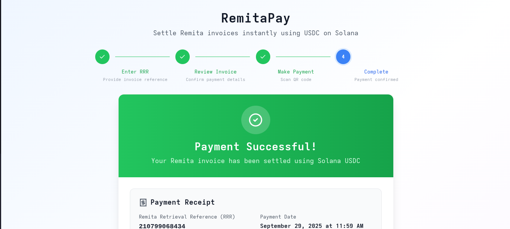

# 🚀 RemitaPay

**Pay School Fees Instantly with Solana & Phantom Wallet**

RemitaPay is a Web3 payment solution that integrates with **Remita** to enable instant school fee payments using **USDC on Solana**. Students can pay directly from their **Phantom wallet** (or any Solana wallet), while schools receive either **NGN via off-ramp** or keep **USDC**.

---

## ✨ Features

- 🔹 **Instant Payments** – Transactions confirm in seconds on Solana.
- 🔹 **Low Fees** – Solana fees are less than $0.01.
- 🔹 **Seamless Integration** – Appears as a new option in the Remita checkout flow.
- 🔹 **Borderless Access** – Students abroad can pay directly in USDC.
- 🔹 **On-Chain Transparency** – Every payment is verifiable on Solana.

---

## 🏦 How It Works

1. Student selects **RemitaPay** as the payment option.
2. Enters their **Remita Retrieval Reference (RRR)**.
3. Invoice details are fetched and displayed in NGN + USDC equivalent.
4. Student scans a **QR code** with Phantom wallet.
5. Payment is confirmed instantly on-chain.
6. School receives **USDC** or **NGN** (via off-ramp).

---

## 📊 Problem

Paying school fees today is:

- ⏳ **Slow** – Bank payments can take hours or days to reflect.
- 💸 **Expensive** – High transaction & FX fees.
- 😓 **Stressful** – Failed transactions, reversals, and long queues at banks.
- 🌍 **Limited** – Students abroad struggle to pay in NGN.

---

## 💡 Solution – RemitaPay

- Extra payment option alongside **Bank, ATM Card, USSD**.
- Students pay instantly with **USDC on Solana**.
- Works with **Phantom wallet** or any Solana wallet.
- Schools get **NGN equivalent** or keep **USDC**.

---

## 📈 Business / Revenue Model

**How RemitaPay makes money:**

- Transaction Fees (0.5% – 1% per transaction).
- FX Spread (USDC → NGN conversions).
- SDK Licensing (for universities & large institutions).
- Premium Features (on-chain receipts, bulk payments, analytics).

**How Remita benefits:**

- New revenue streams from shared transactions.
- Increased volume from crypto-savvy and international students.
- Fewer failed payments → lower operational costs.
- Positioning as a **Web3 payments leader**.

---

## 🌍 Opportunity

- 🎯 $20B+ annual school fee payments in Nigeria alone.
- Millions of students already use Remita.
- Rising adoption of wallets like Phantom & Solflare.
- First mover advantage: bridging **Web2 payments** and **Web3 rails**.

---

## 🛠️ Tech Stack

- **Frontend**: Next.js + Tailwind CSS
- **Blockchain**: Solana + USDC
- **Wallet Integration**: Phantom / Solana Wallet Adapter
- **Backend/Off-ramp**: Node.js / NestJS + APIs

---

## 🚀 Growth Strategy

- **Phase 1** – Pilot with Nigerian universities.
- **Phase 2** – Expand to other Remita merchants (government bills, utilities).
- **Phase 3** – Launch RemitaPay SDK for third-party devs.
- **Phase 4** – Scale across Africa as Web3’s payment layer for education & bills.

---

## 📸 Screenshots

## 

## 🤝 Contributing

We welcome contributions! Fork the repo, create a new branch, and submit a PR.

---

## 📜 License

MIT License – free to use, modify, and distribute.

---

🔥 With **RemitaPa**
